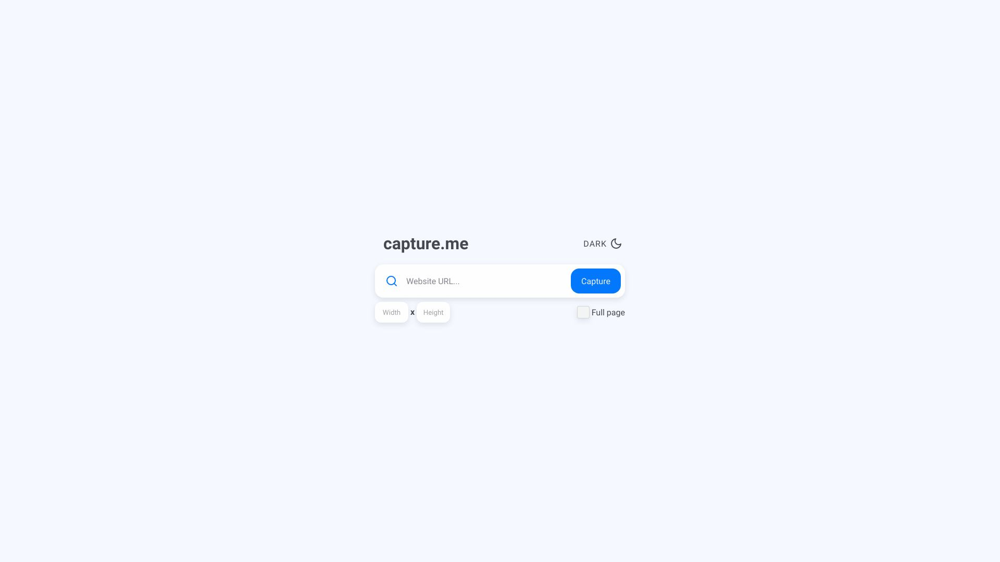

# Capture Me - Take a screenshot of any site

## Table of contents

-   [Overview](#overview)
    -   [The idea](#the-idea)
    -   [Preview](#preview)
    -   [Links](#links)
-   [My process](#my-process)
    -   [Built with](#built-with)
    -   [What I learned](#what-i-learned)
    -   [Further improvement](#further-improvement)
    -   [Useful resources](#useful-resources)
-   [Author](#author)
-   [Acknowledgments](#acknowledgments)

## Overview

### The idea

There are many tools that allow you to take screenshots of websites, but most of them are cluttered with a lot of extra details that do not add value to the tool itself.

That's why I decided to build something simple, yet functional. In fact, I used my application to take the screeshot you see below.

### Preview

### Links

-   [Live Site URL](https://capture-me-nine.vercel.app/)

## My process

### Built with

-   Mobile-first workflow
-   [Typescript](https://www.typescriptlang.org/) a superset of JavaScript that adds optional static typing
-   [React](https://reactjs.org/) - JS library
-   [Create React App](https://create-react-app.dev/) - React meta framework
-   [Axios](https://axios-http.com/) - JS library used to make HTTP requests
-   [Styled Components](https://styled-components.com/) - For styles
-   [API Flash](https://apiflash.com/) - Screenshot API

### What I learned

First of all, I learned to better structure my projects. That is, I found a way to organize folders and files in the most intuitive way for me. In the [acknowledgements] section, there are a couple of posts that inspired me.

Here is a quick overview of other things I got better at:

-   Styled components
    -   Using with typescript
    -   Variables
    -   Theming
    -   Animations
-   Create React App
    -   Working with environment variables
-   API
    -   Working with Axios to make requests
    -   Receiving and managing blob type
-   Accessibility
    -   Understanding principles of a11y
    -   Creating support for keyboard-only users
-   Other
    -   Creating custom hooks like `useTheme`

### Further improvement

Even though the app works and is fully accessible, there is still room for improvement.

For instance:

-   I could add more animations (e.g., for the modal or for the theme toggle);
-   Write some unit tests.

However, none of this would add anything new to the functionality itself, so I'll leave it for now.

### Useful resources

-   [Image Color Picker](https://imagecolorpicker.com/) - This tool helps me to pick the color code from the image. I use it to get a color palette from a certain image.
-   [Coolors](https://coolors.co/) - This is an amazing color palette generator. It is also very useful for finding different shades of the same color.
-   [Feather Icons](https://feathericons.com/) - A collection of beautiful minimalist icons.
-   [Accessibility course](https://web.dev/learn/accessibility/) - This resource helped me better understand digital accessibility.

## Author

-   LinkedIn - [@ironwolf2000](https://linkedin.com/in/ironwolf2000)
-   Second GitHub account - [@Bonrey](https://github.com/bonrey)
-   Frontend Mentor - [@Bonrey](https://www.frontendmentor.io/profile/Bonrey)

## Acknowledgments

-   [Project Structure from Web Dev Simplified](https://blog.webdevsimplified.com/2022-07/react-folder-structure/)
-   [Project Structure from Josh Comeau](https://www.joshwcomeau.com/react/file-structure/)
-   [How to create a loading button animation from Bedimcode](https://www.youtube.com/watch?v=ZaKXVsfIG6g&t=3s)
